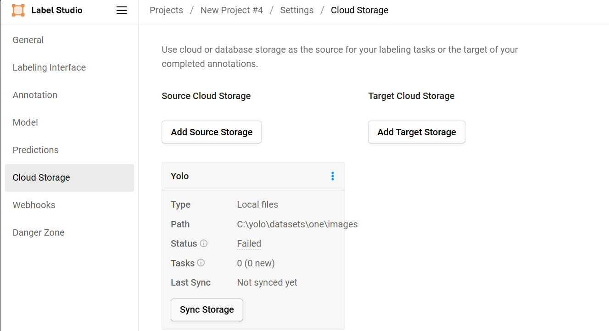
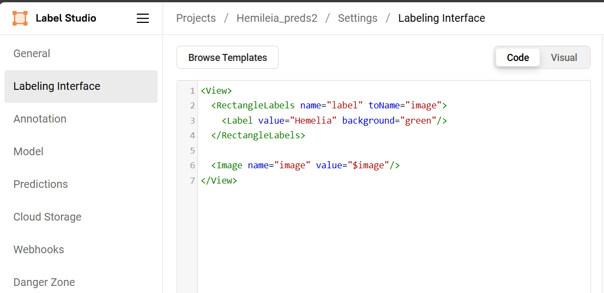

# **Import Annotated Data to Label Studio**
How to import Annotated data to Label-Studio

## **Prerequisites**

Before we begin, ensure you have the following:

- **Label Studio** installed on your local environment. If you haven't set it up yet, follow the instructions [here](https://labelstud.io/guide/install.html).
- **label-studio-converter** installed (included with Label Studio by default).

## **Step 1: Set Up Your Directory Structure**

1. Create the following directory: `C:\\yolo\\datasets`.
2. Inside this directory, create a folder with your dataset name. By convention, we use 'one', but you can choose any name you prefer. The folder structure should be:
```
C:
└── yolo
    └── datasets
        └── one
            ├── images
            ├── labels
            └── classes.txt
```
3. In the `classes.txt` file, write the class names without any additional text. For example:
```txt
Airplane
Car
Pedestrian
```

4. Place your dataset images inside the `images` folder.
5. Place your `.txt` label files inside the `labels` folder.

## **Step 2: Configure Your Environment in Conda Prompt**

1. Activate the Label Studio environment:

```sh
conda activate [your_environment_name]
```
2. Set the environment variables:
```sh
set LABEL_STUDIO_LOCAL_FILES_SERVING_ENABLED=true
set LABEL_STUDIO_LOCAL_FILES_DOCUMENT_ROOT=C:\\yolo\\datasets
```

## **Step 3: Set Up Label Studio**
1. Open Label Studio by running:

```sh
label-studio
```

2. Create a new project without selecting any Label Interface.
3. In Add Source Storage, set the absolute path to your images directory:

```makefile
C:\yolo\datasets\one\images
```

4. If you used a different dataset name, replace one with your dataset folder name.

5. Click on Add, then Sync. Note: It's normal if it shows Failed.

6. Close Label Studio with ctrl+c.



## **Step 4: Convert YOLO Annotations**
1. In Conda prompt, run the following command:

```sh
label-studio-converter import yolo -i /yolo/datasets/one -o output.json --image-root-url "/data/local-files/?d=one/images"
```
- Note: Replace 'one' with the name of your dataset folder if different.

- The command will generate an output.json file in your current environment path, typically shown as:

```less
([your_environment_name]) C:\users\[your_username]:
```
## **Step 5: Import Converted Annotations into Label Studio**
1. Reopen Label Studio.
2. In the project you created, go to Data Manager and select Import.
3. Choose the 'output.json' file for import.
4. Go to `Settings`, then `Labeling Interface`.
5. In the Code section, enter the appropriate template for your project. You can find templates [here](https://labelstud.io/guide/setup).


---
## **Troubleshooting Issues**
If you encounter any issues with paths or image accessibility:

1. Verify `LABEL_STUDIO_LOCAL_FILES_DOCUMENT_ROOT`: Ensure it is configured correctly to point to your dataset directory.
2. Check `--image-root-url` Path: The path should match the relative path from `LABEL_STUDIO_LOCAL_FILES_DOCUMENT_ROOT`.
  - Example: If your absolute local path is `/yolo/datasets/one/images` and `LABEL_STUDIO_LOCAL_FILES_DOCUMENT_ROOT` is `/yolo/datasets/`, then the path for `--image_root_url` should be `one/images`.
3. Local Storage Setup: Ensure the Absolute local path to your images is accurate `(/yolo/datasets/one/images)`.

---
## **References**
[Tutorial: Importing Local YOLO Pre-Annotated Images to Label Studio](https://labelstud.io/blog/tutorial-importing-local-yolo-pre-annotated-images-to-label-studio/#:~:text=Now%20that%20you%27re%20done%20with%20the%20conversion%20process%2C,select%20Import.%20Choose%20the%20output.json%20file%20for%20import.)

[Configure labeling interface](https://labelstud.io/guide/setup)

[Label Studio Task Format](https://labelstud.io/guide/storage)

[Import pre-annotated data into Label Studio](https://labelstud.io/guide/predictions)
